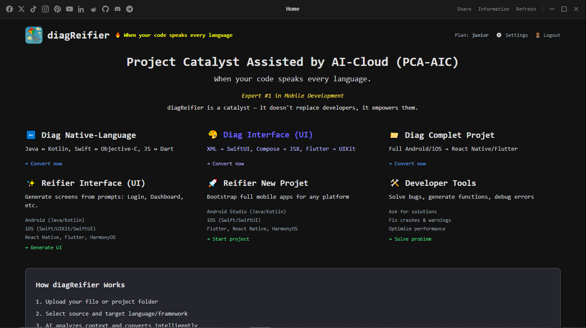

# diagReifier

> **Project Catalyst Assisted by AI-Cloud (PCA-AIC)**  
> *When your code speaks every language.*

**diagReifier** is a desktop application (Windows, Linux/macOS(soon)) specialized in **AI-assisted** code **conversion**, **generation** and **devtools** between major mobile development frameworks.  

## 💻 Download

diagReifier is available for **Windows**, **macOS (SOON)** and **macOS (SOON)**.

📥 **[Download the latest version](https://github.com/diagreifier/diagreifier/releases/tag/1.0.0)**

## 👑 Advantages 🚀

1. **CONVERSION** of complete code/projects between Android, iOS, Flutter, React Native and HarmonyOS. 
2. **GENERATION** of 'new projects' and 'UI' (project scaffolding from prompt).
3. **DEVTOOLS** (Developer Tools) explain, debugging, error fixing, function generation, intelligent assistance thoughout the project.

---

## 🚀 Originality & Pioneer Vision

diagReifier is not a simple code converter; it is the first **contextual and intelligent translation engine** for mobile ecosystems. Its radical originality lies in its ability to understand the *intention* behind the code, not just its syntax.

- **Pioneer of “Code Aware”** — unlike basic tools, diagReifier analyses architecture, dependencies and patterns to produce native-idiomatic code, not an awkward copy. It does not convert lines; it migrates concepts.
- **Dual intelligent core:**
  - **Business Logic Engine** — pure, reliable conversion of algorithms (Kotlin↔Swift, Dart→Java, etc.).
  - **UI Intention Engine** — unique on the market, it interprets an Android XML layout and transcribes it into SwiftUI / Jetpack Compose, respecting each platform’s design guidelines.

---

## 🏆 Best-in-class technology

diagReifier stands out with a superior, uncompromising technological approach:

- **Hybrid & custom AI:**
  - Best-in-class AI layers for pure code conversion, leveraging the most advanced LLMs.
  - **Business rules layer** — a unique, constantly enriched internal knowledge base that maps framework equivalents (Retrofit → Alamofire, Room → Core Data) and corrects LLM idiosyncrasies. This layer guarantees reliability.
- **“Wow” experience:**
  - Drag & drop of full projects.
  - **Detailed conversion report** — a clear overview listing converted files, mapped dependencies, watchpoints and TODOs for the developer.
  - **Ready-to-compile output** — download a perfectly structured Android Studio or Xcode project, with Podfile or build.gradle already configured.

---

## 👥 For every profile

- **Solo developer** — Multiply your porting speed by 10 — from iOS to Android (and vice versa) or to hybrid.
- **ESN & studios** — Standardise processes, reduce dual-team costs and guarantee code consistency across platforms.
- **Learners** — Understand platform differences by seeing how the same concept is implemented on each side.

---

## 👑 Market leadership & differentiation

diagReifier has no direct competitor; it creates and dominates its own category.

| Feature | Existing solutions *(Android Studio, etc.)* | diagReifier *(Leader)* |
|---------|---------------------------------------------|------------------------|
| **Scope** | 1:1 Java↔Kotlin conversion | Multi-language (Kotlin, Swift, Java, Dart, JS, Objective-C) and multi-layer (UI, Logic, Resources) |
| **Intelligence** | Syntactic, word-for-word | Contextual and architectural. Understands the *why* to better translate the *how*. |
| **Result** | Often verbose, non-idiomatic code | Clean, modern, production-ready code |
| **Integration** | Confined to an IDE | Standalone desktop & web app, fits into any workflow |

> ⚡ *“Never rewrite your app from scratch for another platform again. diagReifier gives you a native, production-quality codebase in minutes.”*

---

## 🔧 Supported Frameworks

diagReifier currently supports conversion between:
- Android (Java / Kotlin)
- iOS (Swift / Objective-C)
- Flutter (Dart)
- React Native (JavaScript / TypeScript)
- Harmony OS (C, C++)

---

## 🚀 How It Works

1. **Upload** your file or project folder  
2. **Select** source and target platform  
3. **AI analyzes** context and architecture  
4. **Download** a ready-to-refine ZIP with full conversion  
5. **Refine & deploy** with confidence

---

## 🛠 System Requirements

### Minimum Requirements
- **OS**: Windows 10/11 (32-bit or 64-bit)
- **RAM**: 2GB minimum, 4GB recommended
- **Storage**: 100MB available space
- **Display**: 1280x720 resolution

### Recommended
- **OS**: Windows 11 (64-bit)
- **RAM**: 8GB or more
- **Storage**: 500MB SSD
- **Display**: 1920x1080 or higher

## 🔧 Installation Guide

### NSI Installer (Recommended) / 'Personal use'
1. Download `diagReifier_windows_1.0.0_x64-setup.exe`
2. Run the installer
3. Follow the setup wizard
4. Launch diagReifier from Start Menu

### MSI Installer (Enterprise) / 'Contact us before (custom)'
1. Download `diagReifier_windows_1.0.0_x64_en-US.msi`
2. Double-click to install

## 🔒 Security Features
- Encrypted configuration storage
- Secure Firebase authentication
- Protected API communications
- No data collection or telemetry

## 🐛 Known Issues
- First launch may take longer due to initialization
- Offline functionality limited in v1.0.0
- Some antivirus software may flag as false positive

---
## 💻 Download

diagReifier is available for **Windows**, **macOS (SOON)** and **macOS (SOON)**.

📥 **[Download the latest version](https://github.com/diagreifier/diagreifier/releases/tag/1.0.0-beta.1)**

> ⚠️ An active subscription is required to unlock full features after installation.

---

## 💳 Subscription Plans

Access to diagReifier requires a plan:
- **Junior** – For students & hobbyists  
- **Senior** – For professional developers  
- **Expert** – For teams & enterprise

Plans are billed monthly or annually via **Stripe**. Manage your subscription directly in the app.

---

## 📜 Legal & Support

- **Refund Policy**: Refunds are issued if your plan isn’t activated within 24h of payment, or in case of prolonged service failure.
- **Generated code** may require manual review before production use.
- **Intellectual property**: All rights reserved. Reverse engineering or redistribution is prohibited.

📧 **Contact**: [diagreifier@proton.me](mailto:diagreifier@proton.me)  
© 2026 diagReifier — Author | Folly Rubain KOUEVI

---

> diagReifier is a catalyst — not a replacement. Code smarter, not harder.
